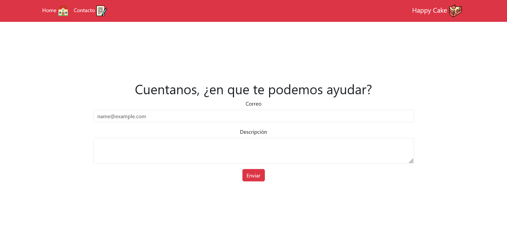

# Desafío - Happy Cake

En este desafío, he construido una aplicación en React que permite a los clientes de Happy Cake SPA realizar cotizaciones y enviar consultas a través de un formulario de contacto.

## Capturas de Pantalla 🖼️

### Vista Home


### Vista Contacto


### Vista Página No Encontrada


## Requerimientos del Desafío 🎯

1. **Instalación de React Router:** Se ha instalado React Router en el proyecto React para gestionar la navegación entre las vistas.

2. **Creación de un Navbar:** Se ha creado un componente Navbar que utiliza el componente Link para las opciones de navegación.

3. **Implementación de Enrutador:** Se ha configurado un enrutador que incluye dos rutas correspondientes a las vistas Home y Contacto.

## Extractos de Código 📝

### App.js

```javascript
import { Route, Routes } from "react-router-dom";
import Navbar from './components/Navbar'
import HomePage from './views/HomePage'
import ContactPage from './views/ContactPage';
import NotFound from './views/NotFound';

function App() {
  return (
    <>
      <Navbar />
      <Routes>
        <Route path="/" element={<HomePage />} />
        <Route path="/contacto" element={<ContactPage />} />
        <Route path="*" element={<NotFound />} />
      </Routes>
    </>
  )
}

export default App
```

### Navbar.js

```javascript
import { Link } from "react-router-dom";
import homeImage from "../assets/img/home.png"
import cakeImage from "../assets/img/cake-logo.png"
import contactFormImage from "../assets/img/contact-form.png"

const Navbar = () => {
  return (
    <nav className="navbar navbar-expand-lg bg-danger navbar-container">
      <div className="container d-flex flex-row-reverse">
        <Link className="navbar-brand text-white" to="/">Happy Cake </Link>

        <button className="navbar-toggler" type="button" data-bs-toggle="collapse" data-bs-target="#navbarSupportedContent" aria-controls="navbarSupportedContent" aria-expanded="false" aria-label="Toggle navigation">
          <span className="navbar-toggler-icon"></span>
        </button>
        <div className="collapse navbar-collapse" id="navbarSupportedContent">
          <ul className="navbar-nav me-auto mb-2 mb-lg-0">
            <li className="nav-item">
              <Link className="nav-link text-white" to="/">Home </Link>
            </li>
            <li className="nav-item">
              <Link className="nav-link text-white" to="/contacto">Contacto </Link>
            </li>
          </ul>
        </div>
      </div>
    </nav>
  )
}

export default Navbar
```

### ContactPage.js

```javascript
import Form from "../components/Form"

const ContactPage = () => {
  return (
    <section>
      <div className="container contact-page-container d-flex flex-column align-items-center justify-content-center">
        <h1 className="text-center">Cuentanos, ¿en que te podemos ayudar?</h1>
        <Form />
      </div>
    </section>
  )
}

export default ContactPage
```

## Tecnologías Utilizadas 💻

- React
- React Router
- CSS

## Cómo Contribuir 🌟

1. Haz un fork de este repositorio.
2. Clona tu fork a tu máquina local.
3. Instala las dependencias con `npm install`.
4. Ejecuta la aplicación en modo de desarrollo con `npm run dev`.
5. Realiza tus cambios y mejoras.
6. Haz commit y empuja tus cambios a tu repositorio en GitHub.
7. Haz un pull request para contribuir tus cambios de vuelta a este repositorio.

## Mejoras Futuras 🚀

Para futuras iteraciones de la aplicación, se podría considerar agregar funcionalidades adicionales como la validación del formulario de contacto, el almacenamiento de las consultas en una base de datos y la implementación de una página de confirmación para las cotizaciones realizadas.
